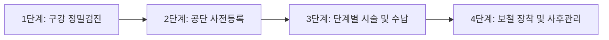

노년기에 접어들며 치아가 손실되면 저작 기능 저하로 인한 소화 장애는 물론, 영양 불균형과 인지 기능 저하까지 이어질 수 있습니다. 하지만 치과 치료비는 비급여 항목이 많아 치아 1개당 100만~150만 원을 호가하는 비용 부담 때문에 치료를 망설이는 분들이 많습니다.

정부에서는 어르신들의 구강 건강 증진과 가계 의료비 경감을 위해 **만 65세 이상 건강보험 가입자에게 치과 임플란트 평생 2개 및 틀니 치료비의 70%를 지원(본인부담금 30%)**하고 있습니다. 

이 글에서는 건강보험 임플란트 적용 대상 조건과 제외 기준, 틀니 지원 혜택, 비급여 추가 비용 절감법 및 단계별 신청 절차를 완벽하게 정리해 드립니다.

---

## 1. 치과 임플란트 건강보험 핵심 적용 조건

건강보험 혜택을 받기 위해서는 국민건강보험공단이 규정한 엄격한 기준을 충족해야 합니다. 자격 요건을 사전에 숙지하지 않으면 혜택 대상에서 제외되거나 전액 비급여로 청구될 수 있습니다.

### ① 연령 및 대상자 기준: 만 65세 이상 부분 무치악 환자
* **연령 요건:** 주민등록상 **만 65세 생일이 지난 날**부터 혜택 신청이 가능합니다.
* **부분 무치악 필수:** 구강 내에 **자연치아가 최소 1개 이상 남아있는 상태**여야 합니다. 치아가 하나도 남아있지 않은 '완전 무치악' 상태는 임플란트 급여 대상에서 제외되며, 대신 '완전틀니' 급여 혜택을 이용해야 합니다.

### ② 지원 개수 및 적용 부위
* **평생 2개 인정:** 상악(위턱)과 하악(아래턱) 구분 없이, 앞니와 어금니 모두 평생 1인당 최대 2개까지 건강보험이 적용됩니다.
* **앞니 적용 조건:** 과거에는 어금니 식립이 불가능할 때만 앞니가 인정되었으나, 기준이 완화되어 현재는 주치의 판단에 따라 앞니도 제한 없이 급여 적용을 받을 수 있습니다.

### ③ 급여 적용 재료와 비급여 제외 항목
> **주의:** 건강보험에서 지원하는 임플란트는 규격화된 표준 재료에 한정됩니다.

* **인정 재료:** 픽스처(고정체) + 분리형 식립 지대주 + **PFM(포셀린 메탈, 도재금속열착보철)** 보철물 기준입니다.
* **비급여 항목 (전액 환자 부담):** 지르코니아(Zirconia), 올세라믹(All-Ceramic), 금(Gold) 보철물을 선택하거나, 맞춤형 지대주(Custom Abutment)를 제작하는 경우 급여 적용이 불가능하거나 차액이 발생할 수 있습니다.
* **뼈이식(골이식술) 및 상악동 거상술:** 잇몸뼈가 부족해 진행하는 치조골 이식술은 건강보험 비급여 항목으로, 병원별로 30만~100만 원 선의 추가 비용이 발생합니다.

---

## 2. 틀니(의치) 건강보험 혜택과 7년 주기 원리

치아가 전혀 없거나 다수의 치아를 상실하여 임플란트 2개만으로 저작 기능을 회복하기 어려운 경우, 건강보험 틀니 지원 제도를 활용할 수 있습니다.

### ① 완전틀니 및 부분틀니 지원 기준
* **완전틀니 (레진상/금속상):** 치아가 하나도 없는 만 65세 이상 어르신을 대상으로 상악 또는 하악 각각 보험이 적용됩니다.
* **부분틀니 (클래스프형):** 잔존 치아를 활용해 고리를 걸어 사용하는 틀니로, 부분 무치악 환자에게 적용됩니다.

### ② 7년 재제작 주기 및 사후관리
* **제작 주기:** 원칙적으로 **7년에 1회**씩 건강보험 혜택을 다시 받을 수 있습니다.
* **예외 인정:** 7년 이내라도 구강 상태가 급격히 변화하여 틀니 재제작이 불가피하다는 의학적 판단이 있거나 천재지변 등으로 분실·파손된 경우 공단 승인을 거쳐 1회 추가 제작이 가능합니다.
* **유지 관리:** 제작 완료 후 3개월 동안은 무상 점검이 제공되며, 이후 틀니 조정 및 첨상(바닥 교체) 등 유지 관리 행위도 건강보험이 적용되어 저렴하게 관리할 수 있습니다.

---

## 3. 임플란트 vs 틀니 건강보험 비교 분석

두 치료 방법은 대상 구강 상태와 본인부담률, 보장 범위에서 명확한 차이가 있습니다.

| 구분 | 건강보험 치과 임플란트 | 건강보험 틀니 (완전/부분) |
| :--- | :--- | :--- |
| **지원 대상** | 만 65세 이상 **부분 무치악** (자연치 1개 이상) | 만 65세 이상 **완전/부분 무치악** |
| **보장 한도** | 1인당 평생 **2개** | 악당(위/아래) **7년마다 1회** |
| **본인부담률** | 일반 30% / 차상위·의료급여 10~20% | 일반 30% / 차상위·의료급여 5~15% |
| **환자 실부담금** | 1개당 약 35만~40만 원 선 (비급여 제외) | 1악당 약 30만~45만 원 선 |
| **기본 보철 재료**| PFM 보철물 (지르코니아 불가) | 레진상, 금속상(코발트크롬) |
| **병원 이동 여부**| **진료 중 치과 변경 불가** (취소 시 전액 비급여) | 원칙적 이동 불가 (부득이한 폐업 시 예외) |

---

## 4. 초보자도 쉽게 따라 하는 4단계 실천 가이드

건강보험 혜택은 별도의 공단 방문 없이 지정 치과의원에서 원스톱으로 등록 및 신청이 가능합니다.

### 1단계: 치과 방문 및 진단
* 파노라마 X-ray 및 3D CT 촬영을 통해 잔존 치아 상태와 잇몸뼈의 밀도를 측정합니다.
* 건강보험 적용 가능 여부(부분 무치악 여부)와 뼈이식 필요 여부를 확인합니다.

### 2단계: 건강보험 대상자 사전 등록
* 치과의원에서 환자의 동의를 받아 국민건강보험공단 전산망에 **'건강보험 치과 임플란트 대상자 등록'**을 진행합니다.
* 등록이 완료되면 고유 등록번호가 생성되어 평생 지원 카운트(2개 중 1개 소진 등)가 차감됩니다.

### 3단계: 3단계 시술 및 본인부담금 분할 납부
임플란트는 통상 3단계로 나누어 진행되며, 비용 역시 각 단계가 끝날 때마다 본인부담금(30%)을 분할 수납합니다.
* **1단계 (진단 및 치료계획):** 구강 상태 진단 및 시술 계획 수립
* **2단계 (고정체 식립술):** 인공 치근(픽스처) 식립 수술 진행
* **3단계 (보철 수복):** 지대주 연결 및 PFM 최종 보철물 장착

### 4단계: 보철물 장착 후 사후 유지관리
* 최종 보철물 장착 후 **3개월 이내**에는 시술 치과에서 임플란트 주위염 처치, 나사 풀림 교정 등을 진찰료만 부담하고 받을 수 있습니다.

---

## 5. 의료비 절감 극대화 및 필수 리스크 관리

### ⚠️ 치과 변경(이동) 절대 불가 원칙
건강보험 임플란트는 등록과 동시에 환자-의사 간 치료 계약이 공단에 묶이게 됩니다. 시술 도중 환자의 변심이나 단순 불만으로 치과를 변경할 경우, 기존 등록 취소와 함께 **기존 단계의 건강보험 급여비용이 전액 환수되거나 환자가 전액 비급여로 배상**해야 할 수 있습니다. 따라서 처음부터 숙련도가 높고 과잉진료가 없는 치과를 신중하게 선택해야 합니다.

### 💡 추가 비급여 견적 꼼꼼히 대조하기
임플란트 본체 시술은 건강보험이 적용되어 약 35만~40만 원 선이지만, 치조골 이식(뼈이식), 상악동 거상술, 임시치아 비용은 비급여 항목입니다. 치과마다 비급여 진료비 편차가 크므로 사전에 전체 예상 견적서를 요구하여 불필요한 추가 시술이 포함되어 있지 않은지 확인하세요.

### 💰 연말정산 의료비 세액공제 활용법
지출한 본인부담금(30%) 및 비급여 뼈이식 비용은 모두 국세청 연말정산 **의료비 세액공제(공제율 15%) 대상**에 포함됩니다. 자녀가 부모님을 기본공제 대상자로 부양하고 있다면 자녀의 연말정산에서 의료비 세액공제를 신청하여 실질 부담금을 더욱 낮출 수 있습니다.

---

## 6. 결론: 현명한 치료를 위한 3줄 요약

1. 만 65세 이상 부분 무치악 어르신은 평생 임플란트 2개와 틀니(7년 주기)를 본인부담금 30%로 치료받을 수 있습니다.
2. 뼈이식이나 지르코니아 보철은 비급여 항목이므로 시술 전 사전 견적을 꼼꼼하게 비교해야 합니다.
3. 치료 도중 치과 변경 시 보험 적용이 취소될 수 있으므로, 초기 정밀 검진과 신뢰할 수 있는 병원 선정이 핵심입니다.

지금 부모님이나 본인의 만 65세 도래 여부를 확인하시고, 가까운 치과에 방문하여 건강보험 혜택 잔여 개수를 조회해 보세요!
