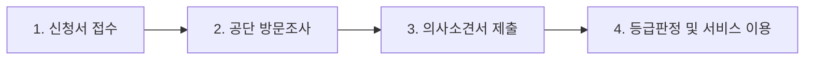

# 노인장기요양보험 등급 판정 기준 및 요양보호사 지원 신청 가이드

부모님의 기력이 예전 같지 않고 일상생활조차 버거워하실 때, 자녀와 가족들의 마음은 한없이 무거워집니다. 특히 눈덩이처럼 불어나는 전문 간병비와 돌봄 부담은 평온하던 가정 경제까지 위태롭게 만들곤 합니다.

하지만 국가가 비용의 85%에서 최대 100%까지 지원해 주는 제도가 있다는 사실을 알고 계셨나요? 바로 보건복지부와 국민건강보험공단에서 주관하는 **노인장기요양보험 제도**입니다.

이 글을 끝까지 읽으시면 다음의 핵심 혜택 3가지를 확실하게 챙겨가실 수 있습니다.

> 1. 우리 부모님이 받을 수 있는 **장기요양 등급(1~5등급, 인지지원등급) 자격 요건**을 한눈에 파악합니다.
> 2. 매월 최대 200만 원 상당의 재가급여 한도 내에서 **요양보호사 파견 서비스를 본인부담금 15% 이하**로 이용하는 방법을 배웁니다.
> 3. 가족이 직접 요양보호사 자격증을 취득해 부모님을 돌보며 **합법적으로 월 40만~100만 원 안팎의 급여를 받는 가족요양 꿀팁**까지 안내해 드립니다.

---

## 1. 노인장기요양보험 대상자 자격 요건 체크리스트

노인장기요양보험은 고령이나 노인성 질병 등으로 인해 6개월 이상 혼자서 일상생활을 수행하기 어려운 분들에게 신체활동 또는 가사활동 지원 등의 장기요양급여를 제공하는 사회보험제도입니다.

신청 전 다음 3가지 핵심 요건을 반드시 확인해 보세요.

* **연령 요건**: 만 65세 이상 어르신 또는 만 65세 미만이라도 치매, 뇌혈관성 질환(뇌출혈·뇌경색), 파킨슨병 등 노인성 질병을 진단받은 자
* **건강 상태 요건**: 거동이 불편하거나 인지기능이 저하되어 6개월 이상 혼자서 세수, 식사, 화장실 이용, 외출 등이 불가능한 상태
* **보험료 자격**: 국민건강보험 가입자 또는 피부양자, 의료급여 수급권자 (소득이나 재산에 상관없이 전 국민 누구나 신청 가능)

### [대상자 자격 자가 체크리스트]
- [ ] 부모님이 만 65세 이상이시거나, 노인성 질환(뇌졸중·치매·파킨슨 등)을 앓고 계신다.
- [ ] 혼자서 옷을 입고 벗거나 식사를 챙겨 드시기 어렵다.
- [ ] 목욕, 세면, 화장실 이용 시 누군가의 부축이 반드시 필요하다.
- [ ] 최근 6개월간 기억력 감퇴, 길 잃음, 배회 등의 치매 의심 증상이 뚜렷하다.
- [ ] 단기 입원이 아닌, 장기적인 가정 돌봄이나 요양시설 입소가 절실하다.

위 항목 중 2개 이상에 해당한다면 주저하지 마시고 즉시 등급 인정 신청을 진행하셔야 합니다.

---

## 2. 노인장기요양보험 등급 판정 기준 및 등급별 점수 총정리

국민건강보험공단에서는 신청 접수 후 직원이 직접 어르신 댁을 방문하여 신체기능, 인지기능, 행동변화 등 52개 항목을 전산 조사합니다. 이 조사 결과를 바탕으로 산출된 **장기요양인정점수**와 의사소견서를 종합해 등급판정위원회에서 최종 등급을 결정합니다.

등급은 1등급부터 5등급, 그리고 인지지원등급까지 총 6단계로 구분됩니다.

### 등급별 심신 상태 및 판정 기준표

| 등급 | 인정 점수 | 심신 및 일상생활 상태 | 주된 권장 급여 형태 |
| :--- | :--- | :--- | :--- |
| **1등급** | **95점 이상** | 일상생활에서 전적으로 다른 사람의 도움이 필요한 상태 (와상 상태) | 시설급여(요양원) / 재가급여 전폭 지원 |
| **2등급** | **75점 ~ 95점 미만** | 일상생활에서 상당 부분 다른 사람의 도움이 필요한 상태 (휠체어 의존) | 시설급여 / 방문요양 및 주야간보호 |
| **3등급** | **60점 ~ 75점 미만** | 일상생활에서 부분적으로 다른 사람의 도움이 필요한 상태 (지팡이·보행보조) | 재가급여(방문요양, 주야간보호, 목욕) |
| **4등급** | **51점 ~ 60점 미만** | 일상생활에서 일정 부분 다른 사람의 도움이 필요한 상태 | 재가급여(방문요양, 가사지원) |
| **5등급** | **45점 ~ 51점 미만** | 치매환자로서 인지관리가 필요하고 일상생활 지원이 필요한 상태 | 인지활동형 방문요양, 주야간보호 |
| **인지지원등급** | **45점 미만** | 신체기능은 양호하나 치매 진단을 받아 일상 관리가 필요한 상태 | 주야간보호(데이케어센터) 이용 |

> **전문가 조언 (E-E-A-T Insight)**: 1~2등급 판정을 받으시면 요양원이나 노인요양공동생활가정 같은 시설 입소(시설급여)가 바로 가능합니다. 반면 3~5등급은 원칙적으로 가정을 방문하는 재가급여가 기본이지만, 동거 가족의 부양 곤란 등 사유서를 제출하면 시설급여로 변경 승인을 받을 수 있습니다.

---

## 3. 구체적인 지원금 모의 계산 및 국비 지원 혜택

장기요양보험은 현금을 통장에 직접 꽂아주는 것이 아니라, 공단이 승인한 **월 이용 한도액 안에서 요양보호사 파견, 목욕, 간호, 주야간보호 센터 이용료의 85%를 공단이 대신 납부**해 주는 방식입니다.

### 2024~2026년 기준 등급별 재가급여 월 이용 한도액
* **1등급**: 월 약 2,170,000원
* **2등급**: 월 약 1,950,000원
* **3등급**: 월 약 1,530,000원
* **4등급**: 월 약 1,420,000원
* **5등급**: 월 약 1,190,000원
* **인지지원등급**: 월 약 660,000원

*(※ 보건복지부 고시 기준이며, 매년 물가상승률에 따라 소폭 인상 조정됩니다.)*

### 본인부담금 감경 비율
* **일반 수급자**: 급여비용의 15% (시설 입소 시 20%)
* **감경 대상자 (중위소득 이하 등)**: 급여비용의 6% 또는 9% (소득수준에 따라 40~60% 감면)
* **국민기초생활수급자**: 본인부담금 0% (전액 국비 지원)

### [실제 시뮬레이션: 3등급 어르신의 재가 방문요양 이용 시]
* **월 한도액**: 약 1,530,000원
* **요양보호사 파견**: 평일 하루 3시간(월 20회) 방문요양 이용
* **총 서비스 이용 금액**: 약 1,200,000원 발생
* **공단 지원금 (85%)**: **1,020,000원 국비 지원**
* **실제 가족 부담금 (15%)**: **단 180,000원**

시중 민간 간병인을 고용하면 월 300만~400만 원이 고스란히 나가지만, 장기요양보험 등급을 받으면 한 달에 약 18만~20만 원대의 본인부담금만으로 전문 요양보호사의 꼼꼼한 가사 및 신체 돌봄 서비스를 이용할 수 있습니다.

---

## 4. [특급 혜택] 가족요양보호사 제도로 간병비 절약과 부수입 창출

장기요양보험의 숨은 꽃이자 훌륭한 가정경제 재테크 수단이 바로 **가족요양 제도**입니다.

자녀, 며느리, 사위, 배우자 등 가족 구성원이 요양보호사 1급 자격증을 취득한 뒤, 재가장기요양기관(방문요양센터)에 소속되어 내 부모님(또는 시부모님·배우자)을 직접 돌보면 국가에서 요양급여를 산정하여 급여를 지급합니다.

* **돌봄 인정 시간**: 하루 60분 (월 20일) 원칙
* **특별 예외 인정**: 만 65세 이상 배우자를 돌보거나 치매로 폭력·폭언 등 문제행동이 있는 경우 하루 90분 (월 31일) 인정
* **월 수령 급여**: 월 약 40만 원 ~ 최대 95만 원 내외 (센터 수수료 제외 후 실지급액 기준)

부모님을 다른 낯선 사람에게 맡기기 꺼려지는 분들에게 안성맞춤이며, 효도도 하면서 가정 경제에 안정적인 추가 수입을 확보할 수 있는 합법적이고 공인된 제도입니다.

---

## 5. 초보자도 쉬운 4단계 신청 절차 및 현장 방문조사 꿀팁

신청은 전혀 어렵지 않습니다. 온라인이나 가까운 관공서를 통해 단 10분이면 접수가 가능합니다.

### 1단계: 인정 신청서 제출
* **온라인 신청**: 국민건강보험공단 노인장기요양보험 홈페이지 또는 스마트폰 'The건강보험' 모바일 앱
* **오프라인 신청**: 전국 국민건강보험공단 지사(노인장기요양보험 운영센터) 방문, 팩스 또는 우편 접수
* **구비 서류**: 장기요양인정신청서, 신청인 및 대리인 신분증 (65세 미만은 노인성 질병 진단서 첨부)

### 2단계: 공단 직원 현장 방문조사 (※ 감점 및 탈락 방지 핵심 팁)
접수 후 일주일 내에 공단 간호사나 사회복지사가 어르신 거주지로 직접 방문합니다. 이때 반드시 자녀 등 보호자가 동석하셔야 합니다.

> **절대 주의해야 할 현장조사 팁**:
> 어르신들은 자존심 때문에 낯선 손님이 오면 평소에 못 하시던 일도 억지로 해내려 하십니다. 공단 직원이 '어르신, 혼자서 잘 걸으시죠?'라고 물었을 때 '그럼, 나 아직 쌩쌩해!' 하시며 무리하게 일어서시다가 등급에서 탈락하는 사례가 허다합니다.
> 
> 반드시 보호자가 곁에서 '평소에 밤마다 화장실 가시다가 넘어지신 적이 많다', '가스 불 끄는 것을 자주 잊어버리신다', '옷 단추를 혼자 못 채우신다' 등 **실제 일상생활에서 겪는 어려움을 가감 없이 솔직하게 증언**하셔야 정당한 등급을 받으실 수 있습니다.

### 3단계: 의사소견서 제출
방문조사 후 공단에서 발급해 주는 '의사소견서 발급의뢰서'를 지참하여 평소 다니시던 병의원이나 보건소에 방문해 의사소견서를 발급받아 공단에 제출합니다. (최근에는 병원에서 공단 전산으로 직접 등록해 줍니다.)

### 4단계: 등급 판정 및 요양보호사 계약
신청일로부터 약 30일 이내에 등급 결과가 우편과 알림톡으로 통보됩니다. 장기요양인정서와 표준장기요양이용계획서를 수령하신 뒤, 인근 우수 방문요양센터를 선택하여 계약을 맺고 요양보호사 서비스를 즉시 시작하시면 됩니다.

---

## 6. 결론: 부모님 건강과 가정 경제를 지키는 3줄 핵심 요약

1. **지금 바로 신청하세요**: 만 65세 이상이거나 노인성 질병이 있으시다면 소득과 관계없이 누구나 신청 자격이 됩니다.
2. **간병비 85% 절감**: 매월 최대 210만 원 상당의 돌봄 혜택을 단 15% 이하의 본인부담금으로 누릴 수 있습니다.
3. **가족요양도 검토해 보세요**: 자격증을 소지한 가족이 직접 케어하면 월 40만~90만 원의 합법적 수입도 발생합니다.

더 늦기 전에 오늘 바로 국민건강보험공단 고객센터(**1577-1000**) 또는 모바일 앱을 통해 부모님의 장기요양 등급을 신청해 보세요. 자녀의 작은 관심이 부모님의 남은 여생과 가정의 평화를 지키는 가장 든든한 보험입니다.
