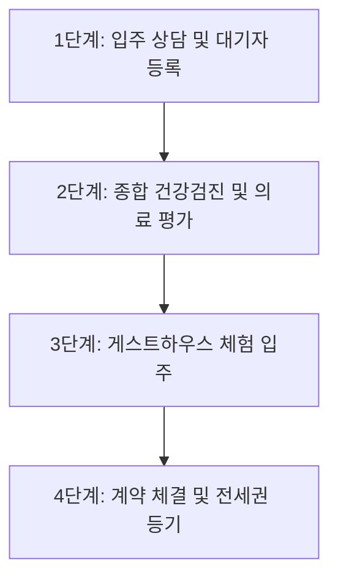

# 시니어 실버타운 입주 비용과 보증금 보호되는 도심형 실버타운 TOP 5

"나이 들어 자식들에게 짐이 되기는 싫고, 병원 가깝고 밥 잘 나오는 곳에서 편안하게 살고 싶은데… 수억 원에 달하는 실버타운 보증금을 혹시 떼이지는 않을까?"

노후 준비를 고민하시는 6070 부모님들과 부모님의 안락한 여생을 챙겨드리고픈 자녀분들이 가장 많이 털어놓으시는 현실적인 고민입니다. 실제로 평생 땀 흘려 일군 주택을 처분하거나 연금을 모아 들어가는 곳인 만큼, 시설의 화려함보다 더 중요한 것은 **'내 피 같은 보증금을 안전하게 지켜낼 수 있는가'**입니다.

2026년 최신 기준 실버타운 입주 비용 체계부터 보증금 안전장치가 완비된 도심형 명품 실버타운 TOP 5, 그리고 연금을 활용한 현금흐름 재테크 설계법까지 낱낱이 풀어드리겠습니다.

> **[핵심 요약 3줄 가이드]**
> 1. **입주 자격**: 만 60세 이상 독립적인 일상생활(스스로 식사·보행·목욕 등)이 가능한 건강 상태여야 합니다.
> 2. **비용 구조**: 입주보증금(퇴소 시 반환) 외에 매월 '일반관리비 + 의무 식대 + 생활공과금'이 고정 지출됩니다.
> 3. **안전 제일**: 반드시 '1순위 전세권 설정' 또는 '서울보증보험(SGI) 가입'이 가능한 운영 주체 탄탄한 곳을 선택해야 합니다.

---

## 1. 시니어 실버타운 자격 요건 및 요양시설과의 차이

많은 분들이 '실버타운'과 '요양원'을 혼동하십니다. 두 시설은 설립 목적과 법적 근거가 완전히 다른 주거 공간입니다.

실버타운은 노인복지법상 **'노인복지주택'**에 해당합니다. 몸이 편찮으셔서 간병을 받는 곳이 아니라, **건강한 어르신들이 가사 노동(청소·식사 준비)에서 벗어나 취미, 운동, 의료 연계 서비스를 누리는 고급 유료 주거 단지**입니다.

### 💡 대상자 필수 자격 요건 체크리스트
- **연령 기준**: 주민등록상 **만 60세 이상** (배우자는 만 60세 미만이어도 동반 입주 가능)
- **건강 기준**: 스스로 일상생활을 영위할 수 있는 **'독립 보행 및 자립 생활 가능자'**
- **건강검진 통과**: 전염성 질환이나 중증 치매, 상시 간병이 필요한 질환이 없음을 증명하는 의사 소견서 제출 필수
- **재정 건전성**: 보증금 완납 능력 및 매월 정기적인 관리비·식대를 감당할 수 있는 안정적인 연금 또는 금융 소득

만약 장기요양등급(1~5등급)을 받고 24시간 간병인의 도움이 필요한 상태라면 실버타운이 아닌 '노인요양원'이나 '노인요양공동생활가정'을 선택하셔야 정부의 노인장기요양보험 급여 혜택(본인부담금 20% 수준)을 받으실 수 있습니다.

---

## 2. 실버타운 입주 비용 구조와 연금 기반 모의 계산

실버타운에 들어갈 때 발생하는 비용은 크게 세 가지로 나뉩니다. 사전에 이 구조를 정확히 알아야 노후 자금의 누수를 막을 수 있습니다.

1. **입주보증금**: 입주할 때 맡기고 퇴소 시 계약 조건에 따라 100% 돌려받는 전세금 성격의 예치금입니다.
2. **월 일반관리비**: 단지 내 피트니스, 수영장, 골프연습장, 사우나, 주거 청소, 보안, 24시간 간호사 상주 등 공용 시설 운영비입니다.
3. **월 식대(식비)**: 대다수 실버타운은 영양 균형과 식당 운영 유지를 위해 1인당 월 30식~60식의 '의무 식대'를 부과합니다. 밥을 안 드셔도 기본 부과되는 경우가 많으니 확인이 필요합니다.

### 📊 부부 기준 월 생활비 모의 계산 예시 (전용 20평형 기준)

* **보증금**: 4억 원 (기존 8억 원 자가 주택 매도 후 4억 원 입주, 잔여 4억 원 금융자산 운용)
* **월 지출 합계**: 약 **330만 원**
  - 기본 관리비 (부부 2인): 170만 원
  - 의무 식대 (1인 60식 × 2인 = 120식, 1식 10,000원 기준): 120만 원
  - 세대별 전기·수도·난방 공과금: 약 40만 원
* **월 소득 및 현금흐름 연계 포트폴리오 (재테크 전략)**:
  - 남편 국민연금: 월 160만 원
  - 아내 국민연금: 월 80만 원
  - 잔여 자산 4억 원 배당/채권형 월지급식 펀드(연 5% 운용): 월 130만 원
  - **총 현금 유입**: **월 370만 원**
  - 👉 **결과**: 월 지출(330만 원)을 충당하고도 **매월 40만 원의 여유 자금**이 남아 손자 용돈이나 여행 경비로 활용 가능합니다.

---

## 3. 보증금 안전장치가 탄탄한 도심형 실버타운 TOP 5 비교 분석

도심형 실버타운은 **대형 대학병원이 인근에 있어 응급 상황 대처가 빠르고, 기존 사회적 관계(친구, 자녀)와 문화생활을 유지할 수 있다는 결정적인 장점**이 있습니다.

수많은 실버타운 중에서도 공신력 있는 대기업, 학교법인, 대형 의료기관이 직접 운영하여 보증금 반환 리스크가 극히 낮은 대표 도심형 실버타운 5곳을 엄선했습니다.

| 순위 & 시설명 | 위치 및 교통 | 보증금 및 월 생활비 (부부 기준 추산) | 보증금 안전장치 | 주요 핵심 특징 및 의료 연계 |
| :--- | :--- | :--- | :--- | :--- |
| **1. 더클래식500** | 서울 광진구 자양동 (건대입구역 도보 3분) | • 보증금: 9억~10억 원 선 • 월 생활비: 500만~600만 원 선 | 건국대학교 학교법인 운영 1순위 전세권 근저당 설정 | • 최고급 호텔식 서비스 및 건국대병원 연계 • 스파, 골프, 전담 주치의 건강관리 시스템 |
| **2. 삼성노블카운티** | 경기 용인 기흥구 (영통역 인근, 셔틀 운행) | • 보증금: 4억~7억 원 선 • 월 생활비: 400만~500만 원 선 | 삼성생명공익재단 운영 재단 차원의 확실한 지급보증 | • 6만 8천 평 녹지+스포츠센터 개방형 단지 • 단지 내 너싱홈(요양시설) 연계 간병 케어 |
| **3. 서울시니어스타워** (강서/가양/신당) | 서울 강서구 / 중구 등 (지하철역 초근접) | • 보증금: 2억 5천~5억 원 선 • 월 생활비: 250만~350만 원 선 | 대장항문 전문 송도병원 그룹 운영 보증금 반환 지급보증보험 가입 | • 국내 실버타운 최다 회원 보유 및 25년 노하우 • 모기업 의료진 상주, 가성비 우수 실속형 |
| **4. 더시그넘하우스** | 서울 강남구 세곡동 (수서역 차량 10분) | • 보증금: 4억 5천~8억 원 선 • 월 생활비: 350만~480만 원 선 | 도타이건설·시그넘케어 운영 신탁사 자금관리 및 전세권 등기 | • 강남권 숲세권 힐링 입지, 삼성서울병원 인접 • 자체 너싱홈 연계로 치매·와병 대비 탁월 |
| **5. VL르웨스트** | 서울 강서구 마곡동 (마곡나루역 지하 직결) | • 보증금: 6억~9억 원 선 • 월 생활비: 450만~550만 원 선 | 롯데건설 시공 & 롯데호텔 운영 HUG 보증 및 안전한 신탁 구조 | • 롯데호텔의 컨시어지 및 다이닝 서비스 • 이대서울병원 직결, 마곡 보타닉파크 인접 |

*※ 상기 금액은 2024~2026년 기준 입주 평형, 식사 횟수 선택, 옵션에 따라 달라질 수 있으므로 공식 상담을 통한 확인이 필요합니다.*

---

## 4. 소중한 보증금 1원도 떼이지 않는 법적 안전장치 3단계

과거 부실한 시행사가 실버타운을 지어놓고 부도가 나 어르신들의 보증금이 묶이거나 떼이는 안타까운 사고가 간혹 있었습니다. 계약서에 도장을 찍기 전, 다음 **3대 안전장치**를 반드시 두 눈으로 확인하셔야 합니다.

### ① 1순위 전세권 설정 등기 가능 여부
실버타운은 주택임대차보호법상 확정일자만으로는 대항력이 불안정할 수 있습니다. 따라서 **등기부등본 을구에 내 보증금에 대한 '전세권 설정 등기'를 1순위로 마칠 수 있는지** 계약서 특약사항에 명시해야 합니다.

### ② 시설물 전체의 근저당(대출) 비율 확인
부동산 등기부등본을 떼어보았을 때, 토지와 건물에 금융권 근저당권(담보대출)이 과도하게 잡혀있는 곳은 절대 피해야 합니다. **[금융권 대출금 + 입주자 보증금 총액]이 건물 감정평가액의 60%를 넘지 않아야** 안전합니다.

### ③ 보증보험 가입 및 공신력 있는 운영 주체
운영 주체가 자본력이 취약한 개인 법인이 아닌지 살펴보세요. **학교법인, 대기업 계열 공익재단, 대형 병원 재단**이 운영하는 곳이 안전합니다. 또한 주택도시보증공사(HUG)나 SGI서울보증의 '임대보증금 반환보증'에 의무적으로 가입되어 있는 사업장인지 확인하시기 바랍니다.

---

<!-- article-illustration:golden-2026-09-07-top-5-01 -->
<figure class="article-illustration" style="margin: 2em 0;">
  
  <figcaption style="margin-top: 0.65em; font-size: 0.95em; line-height: 1.6; color: #475569;">입주 전에는 방뿐 아니라 식사와 휴식 공간도 살펴봅니다. AI로 제작한 설명용 이미지입니다.</figcaption>
</figure>
<!-- /article-illustration:golden-2026-09-07-top-5-01 -->

## 5. 초보자도 쉬운 입주 신청 4단계 절차와 필요 서류

마음에 드는 실버타운이 있다면 무작정 찾아가기보다 체계적인 단계를 밟으셔야 헛걸음하지 않습니다.

### 📝 실천 단계별 가이드
1. **전화 상담 및 현장 투어 예약**: 각 시설 입주상담실에 전화하여 비치된 평형별 실물 호실을 둘러봅니다. 인기 도심형 실버타운은 대기 기간이 6개월에서 2년까지 걸리므로 미리 대기 신청을 해두는 것이 유리합니다.
2. **체험 입주 (게스트하우스 이용)**: 시설마다 1박 2일 또는 2박 3일간 묵어볼 수 있는 체험 프로그램을 운영합니다. 식당 밥맛이 입에 맞는지, 침실 방음은 잘 되는지, 함께 생활할 입주민들의 분위기는 편안한지 직접 겪어보세요.
3. **건강검진 통과**: 최근 3개월 이내 발급된 종합건강검진 결과표를 제출하고 시설 내 간호부서의 면담을 거쳐 독립 생활 적합 판정을 받습니다.
4. **계약서 검토 및 등기**: 계약서상 **'퇴소 시 보증금 반환 기한(통상 1~3개월 이내)'**, **'위약금 규정'**, **'거동 불편 시 너싱홈 연계 조건'**을 꼼꼼히 확인하고 잔금 납부 당일 전세권 설정을 접수합니다.

### 📂 방문 시 필수 구비 서류
* 본인 및 배우자 주민등록등본 1부
* 가족관계증명서(상세) 1부
* 신분증 및 도장
* 종합병원급 건강검진 결과표 및 의사 소견서 (골밀도, 인지기능, 감염병 검사 포함)

---

## 결론: 후회 없는 황혼을 위한 수석 에디터의 최종 당부

실버타운은 단순한 집이 아니라, **인생의 가장 빛나는 노후를 보내는 종합 웰빙 라이프스타일**입니다. 남들이 좋다고 하는 곳에 휩쓸리지 마시고, 부모님의 건강 상태와 부부의 한 달 순수 연금 흐름을 냉정하게 계산해 보셔야 합니다.

매월 지출되는 생활비가 연금 수령액을 초과하여 원금을 계속 갉아먹는 구조라면 머지않아 큰 심리적 불안감에 시달리게 됩니다. **"보증금은 안전하게 묶어두고, 월 생활비는 따박따박 나오는 연금 안에서 해결한다"**는 대원칙을 반드시 지키시길 바랍니다.

더 상세한 노인복지주택 인허가 현황과 지자체별 시설 정보는 **보건복지상담센터(국번 없이 129)** 또는 거주지 시·군·구청 어르신복지과를 통해 안내받으실 수 있습니다.
