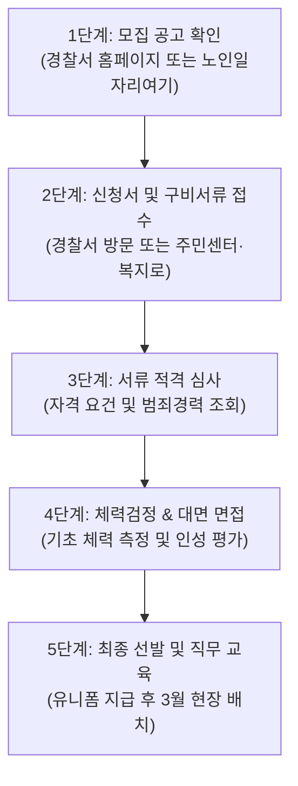

# 시니어 단기 알바 실버안전지킴이·아동안전지킴이 월급과 지원 방법 완벽 가이드

은퇴 후 집에만 머물기보다는 가벼운 운동 삼아 사회 활동도 하고, 쏠쏠한 용돈까지 벌 수 있는 일자리를 찾는 6070 어르신들이 참 많습니다.

하지만 무거운 짐을 나르거나 온종일 서서 일하는 자리는 무릎과 허리에 무리가 갈까 봐 자녀분들도 선뜻 권해드리지 못하는 것이 현실입니다.

이러한 고민을 말끔히 덜어주는 최고의 맞춤형 일자리가 바로 국가와 경찰청, 지자체가 지원하는 **'아동안전지킴이'**와 **'실버안전지킴이'**입니다.

하루 2~3시간 통학로나 놀이터 주변을 산책하듯 순찰하면서 지역 아이들의 안전을 지키고, 매월 안정적인 보수를 받을 수 있어 시니어 단기 활동으로 독보적인 인기를 누리고 있습니다.

> 💡 **이 글을 통해 얻는 핵심 혜택 3가지**
> 1. 내 체력과 나이에 딱 맞는 지킴이 일자리 종류와 예상 월급(수당)을 정확히 알 수 있습니다.
> 2. 신청 자격 체크리스트와 기초연금 감액 없이 수당을 챙기는 실전 노하우를 배웁니다.
> 3. 1년에 단 한 번뿐인 모집 시기부터 면접·체력검정 통과 꿀팁까지 한 번에 정리해 드립니다.

---

## 1. 실버안전지킴이 vs 아동안전지킴이, 무엇이 다른가요?

많은 분이 두 일자리를 같은 것으로 생각하시지만, 주관 기관과 급여 체계, 모집 경로가 확연히 다릅니다.

나에게 유리한 곳이 어디인지 먼저 기본 개념을 정리해 두세요.

### ① 경찰청 주관 '아동안전지킴이'
아동안전지킴이는 경찰청과 관할 경찰서가 직접 주관하는 치안 보조형 복지 일자리입니다.

보통 2인 1조로 구성되어 초등학교 주변 통학로, 놀이터, 학원가 등 아동 밀집 지역을 순찰하며 범죄 예방, 비행 청소년 계도, 길 잃은 아동 보호 활동을 수행합니다.

경찰 조끼와 모자, 경광봉 등을 지급받아 착용하므로 어르신들의 자긍심과 보람이 매우 높습니다.

### ② 보건복지부·지자체 주관 '실버안전지킴이(스쿨존 안전지킴이)'
보건복지부와 한국노인인력개발원, 지역 시니어클럽이 운영하는 노인일자리 사업의 대표적인 유형입니다.

등·하교 시간대 횡단보도에서 노란 깃발을 들고 보행 지도를 돕는 '스쿨존 교통안전지킴이'나 공원, 어린이집 주변을 순찰하는 '실버순찰대' 형태로 운영됩니다.

기초연금을 받는 만 65세 이상 어르신에게 우선순위가 주어지는 '공익활동형'과, 상대적으로 근무 시간이 길고 급여가 높은 '사회서비스형'으로 나뉩니다.

---

## 2. 월급 및 활동비 모의 계산: 한 달에 얼마나 벌 수 있을까?

시니어 단기 일자리를 선택할 때 가장 궁금해하시는 부분이 바로 실수령액입니다.

각 사업별 지급 기준과 세금 혜택을 구체적으로 비교해 보겠습니다.

### ① 아동안전지킴이 급여 (경찰청)
- **근무 시간**: 주 15시간 미만 (통상 평일 주 5일, 하루 약 2.5~3시간 활동)
- **월 지급액**: **월 약 50만 원 ~ 60만 원 선** (연도별·지역별 배정 예산 및 근무일수에 따라 소폭 변동)
- **세금 혜택**: 실비보상 성격의 활동비로 지급되는 경우가 많아 세금 부담이 거의 없습니다.

### ② 실버안전지킴이 급여 (노인일자리 사업)
- **공익활동형 (스쿨존 보행지도 등)**: 월 30시간 (월 10회, 하루 3시간) 활동 시 **월 29만 원** 정액 지급 (전액 비과세 활동수당).
- **사회서비스형 (시니어 시설 안전 등)**: 주 15시간, 월 60시간 활동 시 주휴수당을 포함하여 **월 약 76만 원 내외** 지급 (4대 보험 가입 대상).

### [모의 계산 예시] 68세 박 어르신의 슬기로운 현금흐름
만 68세 박 어르신이 3월부터 12월까지 아동안전지킴이로 선발되어 평일 오후 하루 2.5시간씩 활동할 경우의 수입 구조입니다.

- 아동안전지킴이 활동비: **약 550,000원**
- 기초연금 수령액: **약 334,810원**
- **매월 손에 쥐는 총 현금흐름: 약 884,810원**

무리한 육체 노동 없이 산책 삼아 동네를 걸으며 매달 88만 원 이상의 든든한 용돈을 확보할 수 있어, 어르신들에게는 최고의 가성비 재테크가 됩니다.

---

## 3. 한눈에 보는 안전지킴이 3종 상세 비교표

모바일 화면에서도 보기 편하도록 주요 차이점을 3열 비교표로 정리했습니다.

| 구분 항목 | 경찰청 아동안전지킴이 | 노인일자리 (공익활동형) | 노인일자리 (사회서비스형) |
| :--- | :--- | :--- | :--- |
| **주관 기관** | 경찰청 및 관할 경찰서 | 보건복지부 / 지자체 | 보건복지부 / 시니어클럽 |
| **참여 연령** | 만 60세 ~ 75세 권장 (신체 건강한 자) | 만 65세 이상 (기초연금 수급자) | 만 65세 이상 (일부 60세 가능) |
| **근무 시간** | 월 40~45시간 내외 (일 2~3시간) | 월 30시간 (일 3시간, 월 10회) | 월 60시간 (주 15시간) |
| **예상 수령액** | **월 50만 ~ 60만 원 선** | **월 29만 원** | **월 76만 원 내외 (주휴 포함)** |
| **주요 업무** | 초등학교·놀이터 순찰, 비행 선도 | 스쿨존 등하교 교통안전 지도 | 아동·청소년 시설 안전점검 |
| **선발 방식** | 서류 + 체력검정 + 면접 | 서류 심사 (소득·재산 고득점순) | 서류 심사 + 면접 심사 |

---

## 4. 지원 자격 요건 및 결격 사유 체크리스트

신청 전 반드시 본인이 지원 요건을 충족하는지 아래 체크리스트를 확인해 보세요.

### 필수 자격 요건
- [ ] 대한민국 국적을 보유하고 해당 지역에 주민등록이 되어 있는 분
- [ ] 가벼운 순찰 및 보행 지도 활동을 무리 없이 수행할 수 있는 건강한 신체 조건을 갖춘 분
- [ ] 아이들을 사랑하고 책임감과 봉사 정신이 투철한 분

### 반드시 알아두어야 할 결격 사유 (탈락 대상)
1. **성범죄 및 아동학대 관련 범죄 경력자**: 아동을 보호하는 업무 특성상 범죄경력조회 동의가 필수이며, 관련 이력이 있을 시 즉각 제외됩니다.
2. **정부 재정지원 일자리 중복 참여자**: 다른 정부 직접일자리(국민취업지원제도, 타 노인일자리 등)에 이미 참여 중인 경우 이중 수혜로 참여가 제한됩니다.
3. **신체 부적격자**: 거동이 불편하여 지팡이를 짚거나 장시간 서 있기 힘든 경우 체력검정 과정에서 선발이 어려울 수 있습니다.

---

## 5. 온·오프라인 신청 절차 및 필요 서류

이러한 시니어 단기 알바는 정해진 모집 기간을 놓치면 꼬박 1년을 기다려야 합니다.

신청 일정과 접수 방법을 미리 숙지해 두세요.

### ① 모집 시기
- **아동안전지킴이**: 매년 **1월 초 ~ 2월 중순 사이** 각 경찰서별로 모집 공고가 뜹니다. 활동은 3월 신학기부터 12월 방학 전까지 진행됩니다.
- **실버안전지킴이**: 매년 **11월 말 ~ 12월 중순** 노인일자리 사업 집중 신청 기간에 접수합니다.
- *꿀팁*: 상반기 중도 포기자가 발생하면 4~5월경 수시 추가 모집을 진행하므로, 평소 관할 기관에 결원 여부를 문의해 두시면 좋습니다.

### ② 접수 창구
- **오프라인 방문**: 거주지 관할 경찰서(여성청소년계), 지구대·파출소, 읍·면·동 주민센터, 지역 시니어클럽, 대한노인회 취업지원센터
- **온라인 신청**: 
  - 노인일자리 사업: **'노인일자리여기(seniorro.or.kr)'** 또는 **'복지로(bokjiro.go.kr)'**
  - 아동안전지킴이: 거주지 관할 시·도 경찰청 및 경찰서 공식 홈페이지 '공지사항/채용공고' 확인 후 방문 접수

### ③ 준비해야 할 서류
1. 참여신청서 및 개인정보 수집·이용 동의서 (접수처 비치)
2. 주민등록등본 1부 (최근 3개월 이내 발급분)
3. 증명사진 1~2매
4. 관련 자격증 사본(보육교사, 사회복지사, 무도 유단자증 등 보유 시 가산점 부여)
5. 신체검사서 또는 건강진단서 (최종 합격 후 요구될 수 있음)

---

## 6. 합격을 부르는 실전 면접 & 체력검정 꿀팁

경쟁률이 보통 2:1에서 높은 곳은 4:1에 달하기 때문에 철저한 사전 준비가 합격을 좌우합니다.

### ① 체력검정 통과 요령
아동안전지킴이는 간이 체력검사를 시행합니다. 거창한 운동 능력을 보는 것이 아니라 안전한 보행이 가능한지를 평가합니다.
- **주요 종목**: 제자리 앉았다 일어서기, 눈감고 외발서기(균형감각), 10m 왕복 걷기 등
- **대비법**: 무릎 관절에 무리가 가지 않도록 집에서 하루 10분씩 벽을 잡고 가볍게 스쿼트(앉았다 일어서기)를 연습해 두세요.

### ② 면접관을 사로잡는 모범 답변
- "돈을 벌기 위해 왔다"는 답변보다는, **"내 손주를 지킨다는 마음으로 지역 아이들의 안전한 하굣길을 돕고 싶다"**는 봉사 정신을 강조하세요.
- 단정한 옷차림(깔끔한 셔츠와 면바지, 깨끗한 운동화)과 밝고 또렷한 목소리가 면접관에게 신뢰를 줍니다.

---

## 7. 놓치기 쉬운 불이익 방지 및 핵심 3줄 요약

### 기초연금 감액 걱정 끝내는 꿀팁
많은 어르신이 "지킴이 월급을 받으면 기초연금이 깎이지 않을까?" 걱정하십니다.

- 노인일자리 공익활동형(월 29만 원)과 아동안전지킴이 활동비는 전액 **'비과세 실비수당'**으로 분류되어 근로소득에 잡히지 않으므로 기초연금 수급에 전혀 영향을 주지 않습니다.
- 단, 사회서비스형(월 76만 원)은 4대 보험이 적용되는 근로소득이므로, 다른 임대소득이나 사업소득이 많은 분은 소득인정액 변화를 주민센터에서 사전 상담해 보시는 것이 안전합니다.

> 📋 **오늘 내용 핵심 3줄 요약**
> 1. 아동안전지킴이(월 50~60만 원)와 실버안전지킴이(월 29만~76만 원)는 관절 부담 없이 보람차게 용돈을 버는 최고의 시니어 단기 알바입니다.
> 2. 아동안전지킴이는 매년 1~2월 경찰서, 노인일자리 지킴이는 전년도 12월 주민센터나 복지로에서 신청합니다.
> 3. 활동비 대부분이 비과세 처리되어 기초연금이 깎일 염려가 없으니 안심하고 지원해 보세요.
