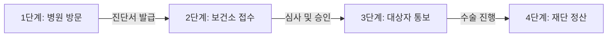

# 2025-2026 노인 무릎 인공관절 수술비 지원 자격과 신청방법 (한쪽 120만원 지원, 노인의료나눔재단)

계단을 오르내릴 때마다 무릎이 쑤시고 콕콕 찔리는 통증 때문에 밤잠을 설치시는 어르신들이 많습니다. 평생 자식들 뒷바라지하느라 닳고 닳은 무릎이지만, 막상 병원에서 "인공관절 수술을 하셔야겠습니다"라는 말을 들으면 수백만 원에 달하는 병원비 걱정에 선뜻 수술 날짜를 잡지 못하십니다.

경제적 부담 때문에 통증을 꾹 참고 계시는 부모님과 자녀분들을 위해 정부와 **보건복지부, (재)노인의료나눔재단**에서는 매년 무릎 인공관절 수술비를 전폭적으로 지원하고 있습니다. 

이 글을 끝까지 읽으시면 지원 자격부터 한쪽당 최대 120만 원(양측 240만 원)을 지원받는 법, 그리고 절대 놓쳐서는 안 될 **'수술 전 사전 신청 원칙'**까지 한 번에 완벽하게 이해하실 수 있습니다.

> **[핵심 혜택 3줄 요약]**
> 1. **지원 대상**: 만 60세 이상 기초생활수급자, 차상위계층, 한부모가족 어르신
> 2. **지원 금액**: 검사비·진료비·수술비 포함 한쪽 무릎 최대 120만 원 (양쪽 최대 240만 원)
> 3. **가장 중요한 점**: 반드시 **'수술을 받기 전'**에 관할 보건소에 신청하여 승인을 받아야 지원 가능

---

## 1. 노인 무릎 인공관절 수술비 지원사업이란?

이 사업은 퇴행성관절염으로 극심한 보행 장애와 고통을 겪고 있으면서도, 경제적인 이유로 치료를 제때 받지 못하는 어르신들의 건강한 노후를 돕기 위한 **국가 복지 의료지원 사업**입니다.

보건복지부가 총괄하고 공익법인인 **(재)노인의료나눔재단**이 전담하여 수행하고 있으며, 전국 각 지자체 보건소를 통해 대상자를 접수하고 심사합니다.

단순히 수술비 일부만 깎아주는 것이 아니라, 수술을 위해 필요한 사전 정밀 검사비부터 본 수술비, 입원 진료비까지 본인부담금 상당액을 실비로 든든하게 메워드립니다.

---

## 2. 지원 대상 자격 요건 체크리스트 (내가 해당될까?)

지원금을 받으려면 세 가지 필수 조건(연령, 소득, 건강 상태)을 모두 충족하셔야 합니다. 아래 체크리스트를 하나씩 짚어보세요.

### ① 연령 기준: 만 60세 이상
일반적인 노인 복지 혜택은 만 65세 이상부터인 경우가 많지만, 무릎 수술비 지원은 일상생활의 조기 회복을 돕기 위해 **만 60세 이상** 어르신부터 신청하실 수 있습니다.
* *2025년 신청 기준: 1965년 이전 출생자 (생일 경과 기준)*
* *2026년 신청 기준: 1966년 이전 출생자 (생일 경과 기준)*

### ② 소득 기준: 취약계층 중심 지원
어르신 본인 또는 함께 사는 가구가 아래 세 가지 중 하나에 해당해야 합니다.
1. **국민기초생활수급자**: 의료급여, 생계급여, 주거급여, 교육급여 수급자
2. **차상위계층**: 차상위본인부담경감 대상자, 차상위자활, 차상위장애수당, 차상위계층 확인서 발급자
3. **한부모가족**: 한부모가족지원법에 따른 한부모가족 보호 대상자

*(※ 소득인정액이란 소득평가액과 재산의 월 소득 환산액을 합산한 금액으로, 주민센터에서 발급받는 증명서 한 장으로 간단히 증빙할 수 있습니다.)*

### ③ 건강(질환) 기준: 인공관절치환술이 필요한 상태
* 정형외과 전문의로부터 **건강보험 급여 기준에 해당하는 슬관절(무릎관절) 인공관절치환술(부분치환술 포함)**이 필요하다는 진단서 또는 소견서를 받으셔야 합니다.
* 통상적으로 관절 연골이 거의 닳아 없어진 **퇴행성관절염 3기~4기(말기)**에 해당합니다.

---

## 3. 지원 금액 및 지원 범위 (모의 계산 비교)

무릎 인공관절 수술비는 환자의 본인부담금 실비를 기준으로 지원됩니다.

* **한쪽 무릎 수술 시**: 최대 120만 원 한도 지원
* **양쪽 무릎 모두 수술 시**: 최대 240만 원 한도 지원

### [지원되는 항목 vs 지원되지 않는 항목]
* **지원 가능 항목**: 수술비 본인부담금, 수술 전 필수 정밀 검사비(MRI, X-ray, 혈액검사 등), 입원 치료비, 인공관절 치료재료비
* **지원 제외 항목**: 간병비, 1~2인실 상급병실 이용 차액료, 보호자 식대, 무릎 수술과 무관한 타 질환 치료비, 진단서 발급 비용

### 3열 일목요연 비교 분석표

| 구분 | 일반 수술 시 (지원 미신청) | 국비 지원사업 선정 시 (본 지원) | 비고 및 주의사항 |
| :--- | :--- | :--- | :--- |
| **한쪽 무릎 본인부담금** | 약 120만 ~ 180만 원 | **최대 120만 원 지원** (초과분만 부담) | 병원 급수 및 비급여 선택에 따라 상이 |
| **양쪽 무릎 본인부담금** | 약 240만 ~ 350만 원 | **최대 240만 원 지원** (실제 부담 50~100만 원 선) | 1차 수술 후 2차 수술 기간 내 완료 필요 |
| **사전 필수 정밀검사비** | 환자 전액 본인 부담 | 수술 확정 시 지원 한도 내 합산 정산 | 수술 전 영수증 및 세부내역서 보관 필수 |
| **간병비 및 상급병실료** | 환자 전액 본인 부담 | **지원 제외** (환자 전액 자부담) | 다인실(4~6인실) 이용 권장 |

### [모의 계산 예시]
만약 차상위계층 김 어르신이 양쪽 무릎 수술을 받고 총 병원비 본인부담금이 290만 원 나왔다면?
* **정부 지원금**: 양쪽 최대 한도인 **240만 원 전액 입금** (재단에서 병원으로 직접 지급)
* **어르신 실제 부담액**: 290만 원 - 240만 원 = **50만 원만 결제**
* 경제적 부담이 80% 이상 획기적으로 줄어들게 됩니다.

---

## 4. 신청 절차 및 필수 구비 서류 (놓치면 안 되는 골든룰)

### ⚠️ 가장 중요한 핵심: "반드시 수술 전에 신청하세요!"
이 사업에서 가장 안타까운 사례는 **'이미 수술을 다 끝내고 보건소에 찾아오시는 경우'**입니다. 

정부 지침상 사후 소급 지원은 **단 1원도 불가능**합니다. 반드시 병원 입원 날짜가 잡히기 전, 수술대에 오르기 전에 먼저 신청서를 접수하고 **'지원대상자 적격 통보'**를 문자로 받으신 뒤에 수술을 진행하셔야 합니다.

### 단계별 신청 절차 (4단계)

1. **1단계 (병원 진단)**: 가까운 정형외과에서 진료를 보고, 인공관절 수술이 필요하다는 **'최근 1개월 이내 진단서(또는 소견서)'**를 발급받습니다.
2. **2단계 (보건소 신청)**: 어르신 주민등록상 주소지의 **관할 보건소**를 방문하여 신청서와 구비 서류를 제출합니다. (거동이 불편하신 경우 자녀나 대리인이 위임장을 가지고 접수 가능)
3. **3단계 (심사 및 통보)**: 보건소 및 노인의료나눔재단에서 적격 여부를 심사한 후 약 1~2주 내에 신청자(또는 보호자)에게 **'지원 대상자 선정 통보 문자/공문'**을 발송합니다.
4. **4단계 (수술 및 정산)**: 통보를 받은 날로부터 **3개월 이내**에 원하는 병원에서 수술을 받습니다. 퇴원 시 수술비 중 지원금(최대 120~240만 원)은 재단에서 병원으로 직접 입금 처리하므로, 환자는 차액만 병원에 수납하시면 됩니다.

### 챙겨가셔야 할 필수 구비 서류 목록

1. **무릎 인공관절수술 지원신청서** (보건소 창구 비치)
2. **의사 진단서 또는 소견서 1부** (최근 1개월 이내 발급, '무릎관절 인공관절치환술 필요' 내용 필수 기재)
3. **저소득층 증빙서류 1부** (주민센터 발급: 기초생활수급자 증명서, 차상위계층 확인서, 한부모가족 증명서 중 해당 서류)
4. **어르신 본인 신분증** (대리인 신청 시: 대리인 신분증, 가족관계증명서, 위임장 지참)

---

## 5. 불이익 방지를 위한 수석 에디터의 실전 꿀팁 3가지

### 팁 1. 대상자 선정 후 3개월 이내에 수술을 마치세요
지원 대상자로 선정되었다는 연락을 받으시면, 선정 통보일로부터 **3개월 이내**에 수술을 받으셔야 유효합니다. 만약 개인 사정이나 건강 악화로 3개월이 넘어가면 선정이 취소될 수 있으니, 기한 연장이 필요한 경우 사전에 보건소 담당자에게 반드시 알려야 합니다.

### 팁 2. 전국 어느 병원에서나 수술이 가능합니다
과거에는 지정된 협약 병원에서만 수술해야 하는 제한이 있었으나, 현재는 환자의 선택권을 보장하기 위해 **전국의 모든 정형외과 병·의원 및 종합병원**에서 수술받으실 수 있습니다. 평소 다니시던 신뢰하는 병원에서 편안하게 수술받으시면 됩니다.

### 팁 3. 간병비와 병실료를 미리 확인하세요
수술비 자체는 정부 지원으로 거의 해결되지만, 개인 간병인을 고용할 경우 하루 13~15만 원에 달하는 간병비는 본인 부담입니다. 병원 선택 시 간호사가 24시간 전문 간병 서비스를 제공하여 건강보험 혜택이 적용되는 **'간호·간병통합서비스 병동'**을 운영하는 병원을 선택하시면 간병비 부담을 수십만 원 이상 크게 아끼실 수 있습니다.

---

## 6. 핵심 3줄 요약 및 문의처 안내

* **누가 받나요?**: 만 60세 이상 기초생활수급자, 차상위계층 어르신 중 무릎 인공관절 수술이 필요하신 분
* **얼마나 받나요?**: 한쪽 무릎 120만 원, 양쪽 무릎 240만 원 한도 내 본인부담금 실비 지원
* **어떻게 신청하나요?**: **수술 전** 진단서를 지참하여 **주소지 관할 보건소**에 방문 신청 (문의: 노인의료나눔재단 ☎ 1661-6595)

부모님의 무릎 통증을 '나이 들면 당연히 아픈 것'이라며 그냥 넘기지 마세요. 걷는 즐거움을 되찾아드리는 가장 따뜻한 효도가 될 수 있습니다. 지금 바로 주소지 보건소에 전화하셔서 올해 예산이 남아있는지 확인해 보세요!
